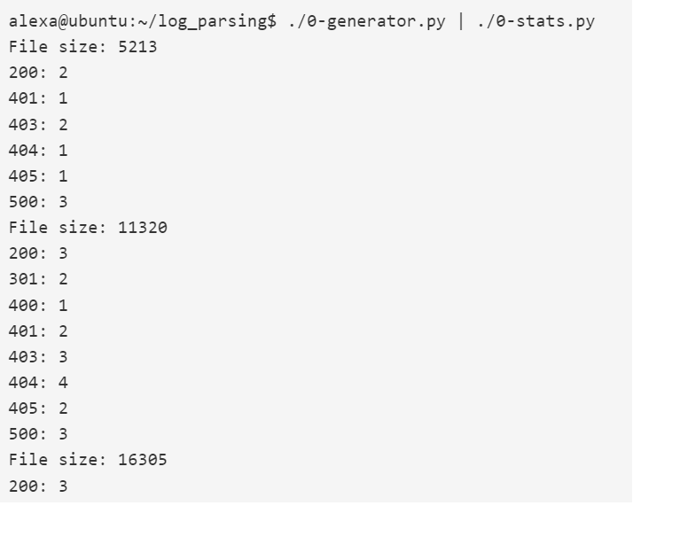

# Log Parsing

El programa procesa la entrada y genera estadísticas sobre el tamaño total de archivo y el número de líneas para cada código de estado, todo ello a partir de una entrada en un formato específico.

## ¿Que son Metricas?

Cuando hablamos de "métricas", nos referimos a medidas o indicadores que se utilizan para evaluar el rendimiento o el comportamiento de un sistema. En este caso del programa que tenemos que hacer, se están calculando métricas relacionadas con el tamaño de los archivos y los códigos de estado HTTP.

Específicamente, el programa calcula dos métricas:

1.  Total de tamaño de archivo: Esta métrica se refiere a la suma de todos los tamaños de archivo procesados hasta ese momento. Cada línea que se lee contiene el tamaño de archivo correspondiente, y el programa acumula esta información para generar el total de tamaño de archivo.
    
2.  Número de líneas por código de estado: Esta métrica se refiere al número de líneas que tienen cada uno de los códigos de estado HTTP posibles (200, 301, 400, 401, 403, 404, 405 y 500). El programa cuenta el número de líneas que tienen cada uno de estos códigos de estado y los imprime en orden ascendente.
    

En resumen, el programa calcula estas métricas para analizar el rendimiento y comportamiento del servidor web al que se está haciendo la solicitud y ver si hay patrones en los tamaños de los archivos y los códigos de estado que puedan indicar problemas o áreas de mejora.

## ¿Significado del ejercicio?

Nuestro código y el que nos proporcionan en el ejercicio genera de manera aleatoria una solicitud HTTP simulada para un recurso específico y un tamaño de archivo. Cada iteración simula una solicitud diferente al servidor. La finalidad de este código es generar un archivo de registro con datos de ejemplo para probar el script que desarrollamos.

Es decir, el progama silimula una solicitud HTTP real con un archivo y un codigo HTTP Y nos devuelve las veces que aperecio el codigo y la suma de los archivos que puede procesar el sistema web. 

